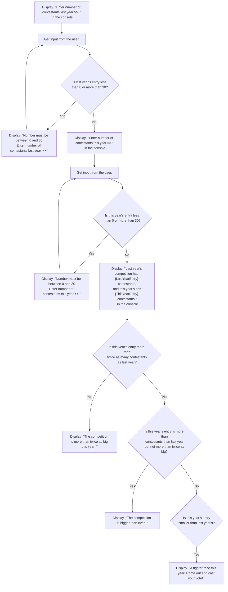

# BIS 305 Assignment 5 - Case Problem 1.

This repo is for use to code and debug the BIS 305 Assignment 5 - Case Problem 1.

### Use Case 1

The inputs in the console could be like:
```html
Enter number of contestants last year >> 6
Enter number of contestants this year >> 31
```

The output from the console should be:
```html
Number must be between 0 and 30
Enter number of contestants this year >> 
```

The inputs in the console could then be:
```html
Enter number of contestants this year >> 14
```

The output from the console should be:
```html
Last year's competition had 6 contestants, and this year's has 14 contestants
Revenue expected this year is $350.00
The competition is more than twice as big this year!
```

### Use Case 2

The inputs in the console could be like:
```html
Enter number of contestants last year >> -1
```

The output from the console should be:
```html
Number must be between 0 and 30
Enter number of contestants last year >> 
```

The inputs in the console could then be:
```html
Enter number of contestants last year >> 10
Enter number of contestants this year >> 20
```

The output from the console should be:
```html
Last year's competition had 10 contestants, and this year's has 20 contestants
Revenue expected this year is $500.00
The competition is bigger than ever!
```

### Use Case 3

The inputs in the console could be like:
```html
Enter number of contestants last year >> 26
Enter number of contestants this year >> 25
```

The output from the console should be:
```html
Last year's competition had 26 contestants, and this year's has 25 contestants
Revenue expected this year is $625.00
A tighter race this year! Come out and cast your vote!
```

### Here is a flowchart for the logic:  
<!-- below from https://github.com/mermaid-js/mermaid -->

